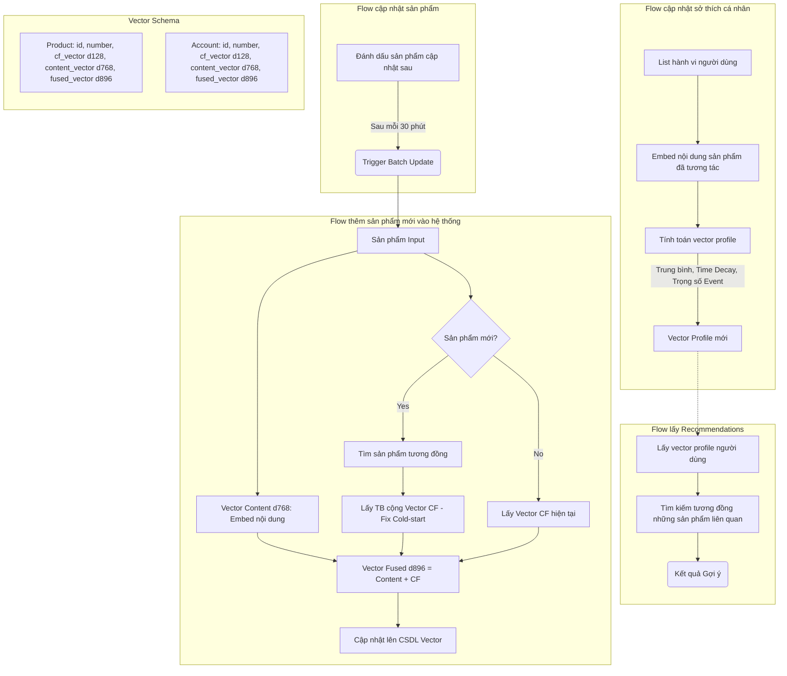

# Shopnexus recommender  

## 1. Tổng quan

Hệ thống hoạt động như một trợ lý ảo thông minh, liên tục quan sát hành vi của người dùng để xây dựng một "chân dung số" (profile) cho mỗi người. Dựa trên chân dung này, hệ thống sẽ tìm kiếm trong kho hàng những sản phẩm có độ tương đồng cao nhất để gợi ý.

  

Điểm đặc biệt của hệ thống là khả năng **học tập thời gian thực** (Real-time Learning): ngay khi bạn vừa xem hoặc mua một món đồ, hệ thống lập tức cập nhật hiểu biết của nó về bạn.

  

## 2. Đặc trưng của sở thích người dùng

  

Để máy tính xử lý được, mọi thứ đều được chuyển đổi thành các dãy số (gọi là **Vector**). Hệ thống sử dụng phương pháp biểu diễn lai (Hybrid Representation):

  

1.  **Vector Nội dung (Content Vector)**: Mô tả sản phẩm "là cái gì". Được tạo ra từ tên, mô tả, đặc tính sản phẩm. Ví dụ: Điện thoại iPhone sẽ có vector gần với Samsung Galaxy (vì cùng là smartphone).

2.  **Vector Cộng tác (Collaborative Filtering Vector - CF)**: Mô tả "ai thích sản phẩm này". Được học từ lịch sử mua sắm của cộng đồng. Ví dụ: Người mua bỉm thường mua thêm sữa, nên bỉm và sữa sẽ có vector CF gần nhau, dù chúng là hai loại hàng khác hẳn nhau.

3.  **Vector Hợp nhất (Fused Vector)**: Là sự kết hợp của hai loại trên, giúp hệ thống vừa hiểu đặc tính sản phẩm, vừa hiểu xu hướng tiêu dùng.

  

## 3. Quy trình xử lý
  

### Bước 1: Tiếp nhận và Đánh trọng số (Weighting)

Khi người dùng tương tác (ví dụ: xem một chiếc áo), hệ thống không chỉ ghi nhận "đã xem", mà còn đánh giá mức độ quan trọng:

*  **Loại hành động**: Mua hàng (Purchase) có trọng số cao hơn nhiều so với chỉ xem (View) hoặc thêm vào giỏ (Add to Cart).

*  **Tính thời điểm (Time Decay)**: Hành động vừa xảy ra quan trọng hơn hành động tuần trước. Hệ thống áp dụng hàm suy giảm để quên dần những sở thích quá cũ.

  

### Bước 2: Tổng hợp & Hợp nhất (Fusion)

Hệ thống lấy vector của tất cả sản phẩm bạn vừa tương tác, nhân với trọng số ở Bước 1, rồi cộng gộp lại.

* Kết quả là một vector đại diện cho **sở thích hiện tại** của bạn (ví dụ: bạn đang rất quan tâm đến "giày chạy bộ màu đỏ").

* Hệ thống kết hợp cả yếu tố nội dung (bạn thích giày) và yếu tố cộng đồng (người mua đôi giày này cũng muốn mua thêm X).

  

### Bước 3: Cập nhật profile

Sở thích con người là sự pha trộn giữa **thói quen lâu dài** và **nhu cầu tức thời**. Hệ thống mô phỏng điều này bằng công thức toán học (Exponential Moving Average):

* Nó lấy "Chân dung cũ" của bạn (những gì nó đã biết từ trước).

* Nó trộn với "Sở thích hiện tại" vừa tính toán được.

* Kết quả là "Chân dung mới" được cập nhật vào cơ sở dữ liệu.

  

=> **Kết quả**: Ngay sau khi bạn click vào vài chiếc váy, hệ thống lập tức "lái" hướng gợi ý sang thời trang nữ, nhưng vẫn không quên rằng bạn vốn thích đồ công nghệ (nếu đó là sở thích lâu dài của bạn).

  

## 4. Cơ chế gợi ý

  

Khi cần hiển thị sản phẩm cho bạn (ví dụ: ở trang chủ), hệ thống thực hiện:

1.  **Truy xuất Profile**: Lấy vector chân dung hiện tại của bạn.

2.  **Tìm kiếm Tương đồng (Similarity Search)**: Quét toàn bộ kho hàng để tìm những sản phẩm có vector gần giống với vector của bạn nhất trong không gian toán học.

3.  **Kết quả**: Những sản phẩm "gần" nhất chính là những sản phẩm phù hợp nhất với cả nội dung bạn quan tâm và xu hướng cộng đồng.

  

## 5. Xử lý khi có Sản phẩm mới (Cold Start)

  

Khi một sản phẩm mới toanh được nhập kho, chưa ai mua, làm sao để gợi ý?

* Hệ thống phân tích tên và mô tả của nó để tìm các sản phẩm cũ tương tự (dựa trên nội dung).

* Nó "vay mượn" thông tin hành vi (CF vector) của các sản phẩm cũ đó gán cho sản phẩm mới.

* Nhờ vậy, sản phẩm mới có thể được gợi ý ngay lập tức cho đúng người mà không cần chờ có người mua đầu tiên.

  

## 6. Sơ đồ Luồng Chi tiết (Detailed Flows)

  

Dưới đây là sơ đồ chi tiết mô tả các luồng xử lý chính của hệ thống, bao gồm logic cập nhật sản phẩm và xử lý vector:

  

  
